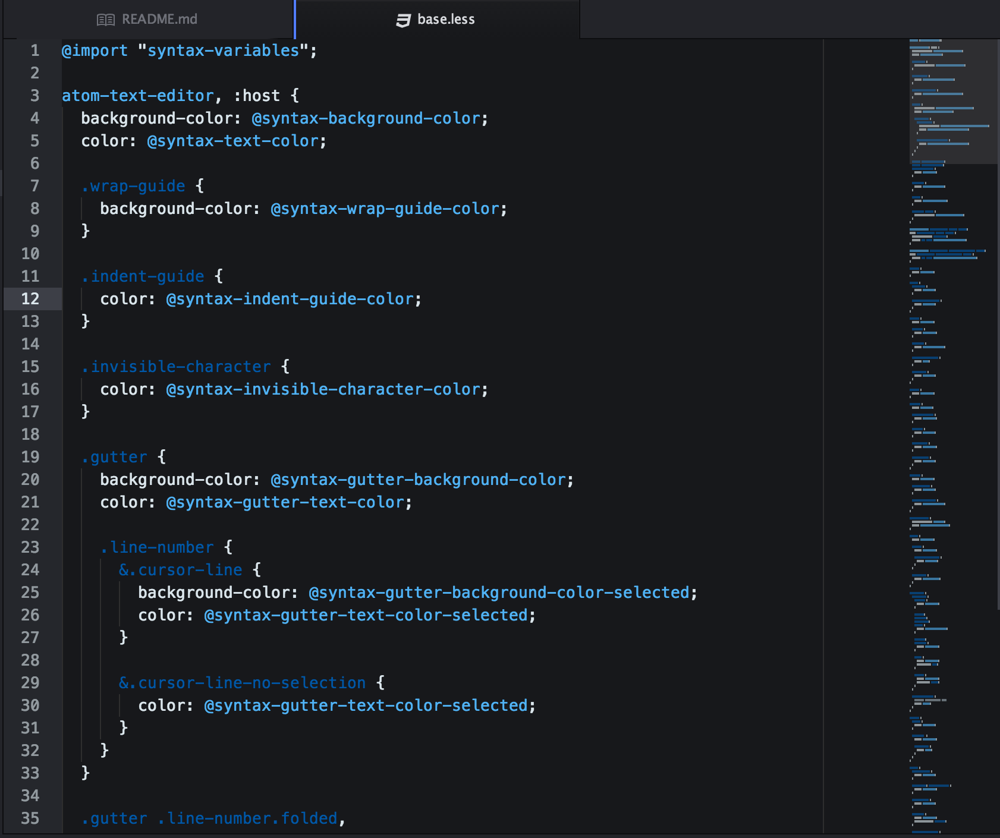

# nightwing-syntax theme for Atom

Simple dark theme, alternating blues, dark grays and white for syntax.

This theme is named and inspired by: [Nightwing!]((https://en.wikipedia.org/wiki/Nightwing) is a [DC Comics](http://www.dccomics.com/characters/nightwing) comic book character.

The Nightwing theme is best paired with [OneDark UI!](https://github.com/atom/one-dark-ui).  

